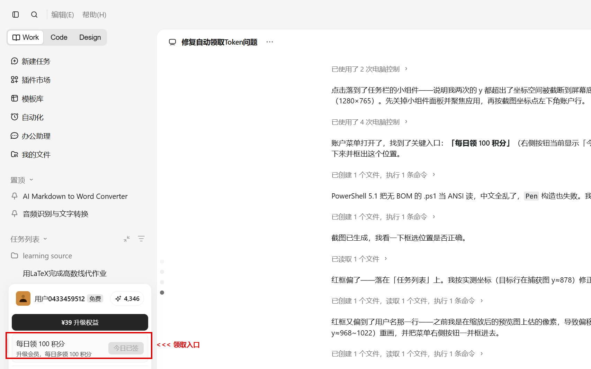
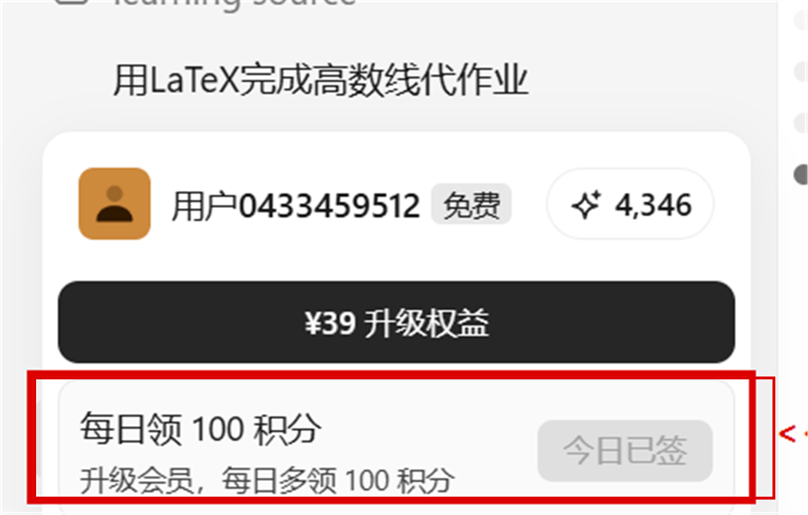

# Token 领取助手

到点自动启动 AI Agent 桌面端领取每日 token 的 Windows 小工具。
覆盖 **ZCode、WorkBuddy、TraeWork CN** 三个客户端；列表里另有 **Trae CN** 条目（编码 IDE，没有每日积分入口，默认不勾选），路径框也可以改成任何其他 EXE。

> **别把 Trae CN 和 TraeWork CN 搞混**：两者是两个不同产品。Trae CN 是编码 IDE（`E:\Trae CN\Trae CN.exe`）；TraeWork CN 才是要每日领积分的那个，它的安装目录和 exe 至今沿用旧名 `TRAE SOLO CN`（`%LOCALAPPDATA%\Programs\TRAE SOLO CN\TRAE SOLO CN.exe`），只有窗口标题和快捷方式显示为 "TraeWork CN"。

依赖极简：核心只需 Python 3.8+ 标准库；安装 `pip install comtypes` 后解锁"智能点击"增强层（推荐）。

## 快速开始

```bat
pip install comtypes      :: 可选，启用智能点击
pip install "geo-captcha @ git+https://github.com/humble26/geo-captcha.git@v2.2.0"
                          :: 可选，启用自动过滑块（滑块求解库，自带 numpy/opencv 依赖）
启动.bat                   :: 或 python token_claimer.py
```

1. 程序已自动探测到本机三个客户端的路径，确认无误后点 **保存设置**。
2. 每个应用行右侧的下拉框是它的 **领取日**（每天 / 仅周末 / 仅工作日），用来错开领取频率。
3. 在「② 定时计划」里添加/删除每日时间点（默认 08:00、12:00、20:00），保存即可——之后任何界面改动停手约 2 秒都会**自动保存**，不怕忘点。
4. 点 **立即领取** 可马上试跑一次，日志区会显示每个应用的结果。

> **界面分区**：常驻显示的是「① 应用」和「② 定时计划」；「③ 启动后行为」「④ 智能点击」收在可折叠的 **高级设置** 里，点标题即可展开，默认收起以免一上来就堆满。设置区高度跟着内容走，放不下时才出现滚动条；富余的竖直空间自动给底部的**运行日志**，日志和操作按钮始终固定在窗口底部。

> **启动脚本会先挑解释器**：`启动.bat` 依次试 `%LOCALAPPDATA%\Python\bin\pythonw.exe`、`pythonw`、`pyw`，只有能 `import tkinter` 的那个才会被采用——pythonw 没有控制台，缺 tcl/tk 的 Python 在 `import tkinter` 阶段就死了，用户看到的正是"双击一下窗口一闪就没了"。一个都不可用时，这个窗口会停住并给出安装提示，不再静默消失；启动阶段的任何崩溃也会写进 `logs\` 并弹框告知，不会查无痕迹。

## 工作原理

- 到点后按 3 秒间隔**依次启动**勾选的客户端——客户端登录后即完成每日 token 领取。
- **领取日（按应用单独设）**：应用行右侧下拉框可选「每天 / 仅周末 / 仅工作日」，到点时只启动当天符合规则的应用，定时触发和「立即领取」都遵守它（手动触发也不会绕过，否则周末配置形同虚设），被跳过的应用会在日志里写明原因。当前配置为 **ZCode 仅周末**，**WorkBuddy / TraeWork CN 每天**。该设置存在 `config.json` 各应用的 `days` 字段（`daily` / `weekend` / `weekday`），老配置没有该字段时按「每天」处理。
- **智能点击（④ 区）**：客户端由本工具启动时附带 `--force-renderer-accessibility` 无障碍参数，启动后工具会用 Windows UI Automation 在其界面里寻找名称含关键词（领取 / 签到 / 加油站 / 免费，可改）的按钮并点击——优先走 Invoke 模式（不移动鼠标），不支持时退回模拟鼠标点击（点击前校验目标点确属该进程窗口，防止误点别的程序）。已实测：TraeWork CN 的两步领取入口、WorkBuddy 的三步领取入口都走多步点击序列（见「多步点击」）。
  - 看到"今日已领 / 今日已签 / 已完成"等完成标识会直接记录成功，不会乱点。这类按钮领取后通常变成 `[禁用]`（TraeWork CN 的「今日已签」、WorkBuddy 的「今日已领」都是），判定**先于**"跳过禁用元素"——否则已领状态会被当成"找不到按钮"一路重试到预算耗尽（实测白转 78 秒）。屏幕外的同名文字仍会被排除，聊天正文里的「已完成」不会误判。
  - **按区域限定查找范围（`region_pct`）**：关键词撞上聊天正文/任务列表是真实存在的坑——TraeWork CN 的对话里就写着"用户""领取"这些字，而正文元素同样属于可点类型。给某一步配 `region_pct` 后，只在该窗口的指定百分比区域内找元素（见「多步点击」）。
  - **窗口最小化时先还原再查找**：最小化的窗口拿不到真实坐标（`GetWindowRect` 会返回屏幕外的垃圾值，实测 ZCode 是 `(-21333,-21333)-(-21175,-21307)`，尺寸 158x26），拿它做百分比区域过滤会把本来在区域内的元素判成"不在区域内"，最终误报成"没找到按钮"。工具在查找前会先还原最小化的窗口（坐标点击模式同样如此），并优先用 UIA 根元素的包围盒代替 `GetWindowRect`；万一矩形仍不可用（完全落在虚拟屏幕之外），会明确提示"目标窗口已最小化"并**按重试处理**（还原窗口即可继续），重试预算用尽才放弃，日志会写清"还原窗口后重试即可"，而不是当成未知错误糊弄过去。
  - **界面树只在窗口处于前台时才存在**：Chromium/Electron 客户端（WorkBuddy、TraeWork CN）的 UIA 树与窗口前台状态绑定——窗口一旦被别的程序抢走前台，树会在几秒内从 ~180 个元素塌成 8 个无名 Pane，此后所有关键词查找都落空（日志表现为"界面树没有内容（该实例未带无障碍参数启动，或运行中树已塌陷）"）。所以工具在**每次查找元素前先把目标窗口激活到前台**（用 `AttachThreadInput` 借用前台线程的输入队列，后台运行时也能成功置前），并在发生前台切换后等约 2 秒让树重建。代价是会短暂抢占一次前台焦点，但**不会关闭或重启客户端**。
  - **界面树始终不可用时自动优雅重启**：如果窗口已经在前台、等足时间后树仍为空，说明这个实例不是带 `--force-renderer-accessibility` 启动的（多半是你自己先开着、工具启动时只是把请求交给了旧实例），树不会自己长出来，只能冷启动。此时工具会**优雅关闭该客户端 → 等它退出（超时升级强杀）→ 带无障碍参数重新拉起 → 重跑领取流程**，单次任务最多重启 2 次；把 `restart_if_no_tree` 设为 `false` 可关掉这个自愈、退回"按重试预算放弃"的老行为。实测这是唯一能救回"没带参数实例"的手段。
  - 个别客户端的入口名跟通用关键词对不上，代码里已预置按应用覆盖（见 `DEFAULT_PER_APP_CLICK`：TraeWork CN 两步走「用户 → 签到」，WorkBuddy 三步走「头像 → Buddy加油站 → 立即领取」，ZCode 单步走左下角 banner「打开」）；`config.json` 里的同名配置优先级更高。
- 「启动后保持 N 分钟」（默认 10，可设 0 表示不关闭）：到时先给窗口发一条 WM_CLOSE，让它走自己的关闭流程；20 秒后仍在运行才强制结束，避免客户端常驻吃内存。
  - 这里**不能用 `taskkill /IM` 当"礼貌关闭"**：Electron 客户端的渲染/GPU/工具子进程都没有顶层窗口，taskkill 关不掉它们，于是这一阶段必然失败、必然升级成硬杀整棵进程树，把客户端搞成"未响应"。所以礼貌关闭改成发 WM_CLOSE，由客户端自己保存状态、释放单实例锁、带走子进程。
- **错过补领**：电脑当时关机/睡眠错过时间点，在宽限期（默认 120 分钟）内打开本工具会自动补执行一次；首次安装后第一次打开不会自动触发，避免突然拉起全部客户端。
- 「固定间隔」模式：每隔 N 分钟执行一次，适合想全天多次刷新的场景。
- **重复启动不会"闪退"**：已经有一个实例在跑时，再点一次会把它的窗口提到前台（最小化则还原；提不到前台就闪任务栏图标），而不是弹一句"已在运行中"就退出——后者看起来和"打开就闪退"一模一样。本工具同一时刻只允许一个实例。

## 按钮哪天变了怎么办（维护指南）

客户端改版导致领取按钮改名/移位后，智能点击会重试若干次后放弃并在日志提示。此时：

> ⚠️ `--inspect` 只能枚举**带 `--force-renderer-accessibility` 启动**的实例。自己手动双击打开的客户端界面树是空的（只能看到最小化/关闭几个按钮）。要枚举它，得先**由你自己退出**该客户端（托盘图标右键 → 退出），再让本工具带参数启动一次，然后执行下面的命令。本工具不会替你关掉或重启它。

```bat
:: 1. 先让本工具带无障碍参数启动该客户端，然后运行：
python token_claimer.py --inspect WorkBuddy.exe

:: 2. 从列出的界面元素里找到新按钮的名字（可加筛选词）：
python token_claimer.py --inspect WorkBuddy.exe | findstr 领取
```

然后四选一：

1. 把新名字加入界面「④ 智能点击」的关键词框（全局生效）；
2. 在 `config.json` 的 `per_app_click` 里为单个应用配置专属关键词：
   ```json
   "per_app_click": { "zcode": { "keywords": ["领取", "签到"] } }
   ```
3. 按钮找不到名字时，配置固定坐标（占窗口宽高的百分比，随窗口大小缩放）：
   ```json
   "per_app_click": { "trae": { "point": [50.0, 12.0] } }
   ```
4. 入口藏在菜单/浮层里、要先点开才出现时，配置多步序列（可给每步加 `region_pct` 把查找范围圈死）：
   ```json
   "per_app_click": {
     "traework": {
       "steps": [
         { "desc": "打开账户菜单", "keywords": ["用户"],
           "region_pct": [0, 92, 25, 100], "wait": 2.0 },
         { "desc": "点击签到按钮", "keywords": ["签到"],
           "region_pct": [0, 40, 17, 100] }
       ]
     }
   }
   ```

   `region_pct` 是 `[x0%, y0%, x1%, y1%]`，元素中心落在该矩形内才算候选。写错格式（少一项、x0≥x1 等）按"没配"处理，不会打断领取。
   `per_app_click` 还支持 `"launch_args": ["--some-flag"]` 覆盖启动参数。注意 `steps` / `keywords` / `point` 三者是「谁出现谁说了算」：一旦你在配置里写了其中任意一个，代码里的预置写法就整体让位，不会出现两者混用。
   另外可加 `"hint": "…"`：半自动应用（如 ZCode 点开入口后需人工过滑块）在**点中最后一步之后**把这句提示写进日志，提醒用户接手。它不属于「点哪里」的键，不会顶掉预置步骤。

## 多步点击（TraeWork CN / WorkBuddy 的入口）

有的客户端领取入口不直接显示，要先点开菜单/浮层才出现，代码里按实测流程预置成多步序列（见 `DEFAULT_PER_APP_CLICK`）：

- **TraeWork CN（两步）**：先点开左下角用户名那一行，菜单展开后点右侧的「签到」按钮（未领取时显示「签到」，已领取时显示「今日已签」）。第二步只认「签到」：「每日领 100 积分」是左侧标签（文本节点，且在树序里排在按钮前面），「领取」会命中聊天正文和左侧任务卡片。
- **WorkBuddy（三步）**：先点左下角头像（元素名就是账号昵称），在账户菜单里点「Buddy加油站 去邀约 最高得 650 积分/人」，卡片展开后点「立即领取」。第二步认的是菜单项完整前缀「Buddy加油站 去邀约」——只写「加油站」会命中卡片里的「关闭 Buddy 加油站」，只写「Buddy加油站」会命中期数标签「Buddy加油站·10期」。

每一步独立重试，上一步点成功后等 `wait` 秒（默认 1.2 秒）再走下一步，给菜单渲染留时间；日志会写明走到了哪一步。另外有两个防呆设计：

- **跳步**：如果在前置步骤上就检测到「今日已签」这类完成标识，说明菜单本来就开着且今天领过了，会直接跳到最后一步确认，不会傻乎乎再点一次前置按钮把菜单**关掉**（toggle）。
- **探测**：执行前置步骤前，先只看不点地检查最后一步的目标是否已经在界面上；在的话直接跳到领取，同样是为了避免把已展开的菜单点关。

### 入口位置实拍

两张核对截图，红框处即领取入口（拍摄于 2026-10-01）：





### 校准（只读，不会关闭或重启客户端）

> ⚠️ **校准脚本不碰你正在用的客户端。** 早先的版本为了拿到界面树，先 `taskkill`、4 秒后升级成 `/T /F` 硬杀整棵进程树、紧接着又把客户端拉起来——TraeWork CN 就是这么被跑成"未响应"的。那段逻辑已彻底删除，并有回归测试盯着它不许回来（`tests/test_close_safety.py`）。

双击 **`校准领取入口.bat`** 即可。它会问你一句要不要顺带点开账户菜单，然后：

1. 客户端**没在运行** → 带 `--force-renderer-accessibility` 启动它（只是启动，不影响别的东西）；
2. 客户端**正在运行** → 原样不动地读它当前的界面树；
3. 树是空的（说明这个实例不是带参数启动的）→ 明确提示"**请你自己退出它，再重新运行本脚本**"，然后把决定权交回给你；
4. 把界面元素清单写入 `logs\ui_dump_traework_<阶段>_<时间戳>.txt`（`before` = 菜单未展开，`menu` = 点开菜单后）。

清单每行形如 `[ct50000] 用户0433459512 用户0433459512 免费 @(24,1463) 348x48 [可点]`，结尾的 `[可点]` 表示该元素类型能被智能点击命中，位置是窗口内的像素坐标。

命令行等价写法：`python token_claimer.py --calibrate traework [--open-menu]`（key 见 `config.json`，可校准任意应用）。另外 `--inspect "镜像名" [--inspect-contains 文字] [--inspect-max N]` 可以看已带参数实例的界面树。

> **为什么非要带参数启动**：Electron 客户端只在**启动时**带无障碍参数才暴露界面树。运行中的普通实例只能看到窗口边框（实测 TraeWork CN 仅 13 个元素，全是标题栏按钮）；"先向 UIAutomationCore 声明监听以触发惰性开启"这条捷径也实测无效。所以"让工具带着参数启动它"是这套方案的前提，而不是可以绕过的步骤。
>
> 另外，即使带了参数，界面树也**只在窗口处于前台时才存在**：窗口被别的程序抢走前台几秒后，树会塌成 8 个无名 Pane，直到重新激活窗口才恢复。所以自动点击在每次查找前都会先激活目标窗口（见上文「智能点击」），`--inspect` / 校准也要在该窗口处于前台时读，才看得到完整树。

### 校准结果（TraeWork CN 2026-10-02、WorkBuddy 2026-10-03 实测）

**TraeWork CN**（窗口 2561x1529，清单 `ui_dump_traework_menu_20261002_165347.txt`）：

| 项 | 实测值 |
| --- | --- |
| 第一步：账户行元素名 | `用户0433459512 用户0433459512 免费`（`ct50000` 按钮，可点） |
| 第一步位置 | `@(24,1463) 348x48`，中心 **(7.7%, 97.3%)** |
| 第一步关键词 / 区域 | `["用户"]` / `(0, 92, 25, 100)` —— 左下角 25%×8% 的角 |
| 第二步：真按钮 | `签到` @(313,988) 102x37（`ct50000`），中心 **(14.2%, 65.8%)** |
| 第二步关键词 / 区域 | `["签到"]` / `(0, 40, 17, 100)` |

第一步的区域是**必须的**，不是保险：清单里同时存在 `[ct50020] … @(1639,-846)` 这种聊天正文元素，正文元素也属于可点类型，不圈区域就会点到对话上。第二步同理，区域把 x 收到 17%（菜单右缘 428px，聊天列从 452px 起）。

第二步只能认「签到」：菜单里 `每日领 100 积分` @(47,980) 只是左侧标签（`ct50020` 文本节点，且在树序里排在按钮前面），点它等于白点；而「领取」会命中聊天正文和左侧任务卡片（实测左侧面板里就有"修复自动领取Token问题"），这些元素同样可点且排得更靠前。

**WorkBuddy**（窗口 2561x1529，清单 `ui_dump_workbuddy_avatar_*.txt` / `ui_dump_workbuddy_card_*.txt`）：

| 步 | 目标元素 | 位置（窗口内） | 关键词 / 区域 |
| --- | --- | --- | --- |
| 1 | 底部头像 `Hush`（`ct50020`） | `@(437,1261)` → (17.1%, 82.5%) | `["Hush"]` / `(0, 72, 30, 100)` |
| 2 | 菜单项 `Buddy加油站 去邀约 最高得 650 积分/人`（`ct50000`） | `@(393,829)` 307x88 → (21.3%, 57.1%) | `["Buddy加油站 去邀约"]` / `(0, 35, 40, 80)` |
| 3 | 卡片按钮 `立即领取`（`ct50000`） | `@(399,1195)` 101x29 → (17.6%, 79.1%) | `["立即领取"]` / `(0, 70, 30, 100)` |

第二步的关键词是这里最容易踩坑的地方：卡片展开后树里还有两个含「加油站」的元素——`关闭 Buddy 加油站`（排在真按钮前面）和期数标签 `Buddy加油站·10期`。只写「加油站」会命中前者（把卡片点开又点关，表现就是"只把加油站点开了、没点领取"），只写「Buddy加油站」会命中后者；取菜单项完整前缀「Buddy加油站 去邀约」才只命中菜单项本身。领取后按钮会变成 `今日已领`（`[禁用]`），负向词据此判定"今天已完成"。

### 其它注意

- 通用关键词里的「免费」容易误命中界面上的"免费"角标（TraeWork CN 用户名旁就有一个），给单个应用配 `keywords` 时建议避开。

## 半自动领取（ZCode）

ZCode 的领取入口是左下角侧边栏底部的推广 banner，无障碍树里只暴露成一个名为 **`打开`** 的按钮（旁边还有一个 `关闭`）。点它之后会弹出**安全验证（滑块）**，需要人工拖滑块才能到账——所以 ZCode 是**半自动**：工具负责把入口点开，滑块得你自己过。点中入口后日志会写两行：

```text
✔ ZCode：已自动点击 鼠标点击“打开”
→ ZCode：请在 ZCode 弹窗中手动拖滑块完成安全验证，验证通过后 token 才会到账
```

关键词「打开」太通用，所以预置步骤必须配区域，把查找圈在左下角 20%×20%：

| 项 | 实测值（窗口 1707x1019，清单 `ui_dump_zcode_home.txt`） |
| --- | --- |
| 入口元素 | `打开` @(16,865) 236x96（`ct50000` 按钮，可点） |
| 入口中心 | **(7.9%, 89.6%)** |
| 关键词 / 区域 | `["打开"]` / `(0, 80, 20, 100)` |
| 点击后 | 弹出滑块验证（`请完成安全验证`），此时入口变 `[禁用]` 并显示"正在验证…" |

**为什么必须配区域**：实时清单（`ui_dump_zcode_live_0926.txt`，窗口 2561x1529）里，整棵树唯一含「打开」的可点元素是右上角工具栏的 `在 资源管理器 中打开` @(2184,22) —— 不圈区域就会点到它。区域把 x 收在 20%（窗口 1707 时 x≤341，窗口 2561 时 x≤512），工具栏按钮被挡在外面。

**banner 是临时的**：它是"待领取"的推广位，当天领取完成后就从界面上消失（实测 09:26 的清单里已无此元素）。所以"某天点不到 banner"未必是配置错了，可能只是当天已经领过；此时界面树是正常的、只是没有这个按钮，属于"再等也不会来"，工具约 15 秒就会收手并记一条提示，属正常。

banner 贴着窗口底边、宽度随左侧栏（约占窗口宽 15.5%），换任何窗口尺寸它的百分比位置都稳定（中心约 x 7.7%、y 87%~92%），区域不会因窗口大小变化而失效。

> **需要人工在场**：定时到点时工具会把入口点开，但滑块必须你来过。若 ZCode 是本工具启动的，默认"启动后保持 10 分钟"后会把它自动关闭，请在这段时间内完成验证；若 ZCode 本来就开着（工具不会重复启动、也不会替你关闭它），窗口会一直留着，时间上更从容。

## 自动处理滑块验证码（可选）

上面这套 ZCode 流程默认是**半自动**（工具点开入口、人工拖滑块）。打开「高级设置 → 验证码（滑块）→ 自动处理滑块验证码」后，工具会接着把滑块也拖过去，实现全自动。**默认关闭**：关闭时领取主流程与不带本功能时逐字一致。

开启后 ZCode 的日志从两行变成：

```text
✔ ZCode：已自动点击 鼠标点击“打开”，等待安全验证…
✔ ZCode：安全验证已通过（method=edge_only score=0.93 距离=189.0px）
```

失败则按预算重试，用尽后转人工，不会卡住领取流程：

```text
· ZCode：第 1/5 次自动验证未通过（浮层仍在（…））
⚠ ZCode：5 次未能自动通过验证码，转人工。请在 ZCode 弹窗中手动拖滑块完成安全验证…
```

**工作原理**（路线 B：屏幕截图 + SendInput，勘察见 `docs/验证码勘察报告.md`）：

1. 点开入口后从**实时无障碍树**定位验证码浮层：特征文本（`请完成安全验证` / `拖动滑块完成拼图` / `刷新验证码`）+ 拼图区图片元素 + 无名滑块手柄，**不写死任何像素坐标**；
2. DPI 感知地抓全屏（桌面 DC 的 BitBlt），按拼图区包围盒裁出合成图；
3. 用求解库 `slider_captcha` 的 `find_gap` 定位缺口（拼图块拿不到 alpha，走 `edge_only` 兜底，并排除左侧拼图块本身）；
4. `build_choreography` 生成拟人轨迹，用 `SetCursorPos` + `SendInput` 按住滑块拖到位；
5. 浮层元素消失即判定通过。

**配置**（`config.json` 的 `captcha` 块，界面上的开关会同步写回）：

| 字段 | 默认 | 说明 |
| --- | --- | --- |
| `enabled` | `false` | 总开关；与应用的 `per_app_click.<key>.captcha` 是"与"关系 |
| `route` | `screen` | 交互通道，目前只实现 `screen`；`cdp` 是预留升级位（未实现 → 不启用） |
| `max_attempts` | `5` | 单次验证码最多尝试几次，超过转人工 |
| `retry_seconds` | `3` | 两次尝试的最小间隔（限频） |
| `wait_seconds` | `2.5` | 点开入口后等浮层渲染的秒数 |
| `min_gap_score` | `0.55` | 缺口定位置信度门槛，低于它不拖（避免乱拖） |
| `drag_scale` / `drag_bias` / `piece_x0` | `1.0 / 0 / 0` | 缺口像素 → 拖动距离的换算，**现场标定项** |
| `settle_seconds` | `1.2` | 松手后等结果的时间 |
| `debug_save` | `false` | 失败时把合成图/标注图写到 `logs\captcha_*.png`，供人工核对 |

> ⚠ **标定状态**：`drag_scale` / `drag_bias` / `piece_x0` 尚未在真实验证码上标定（勘察当天 ZCode 没有领取入口，无法触发）。首次真实运行请保持 `debug_save: true`，失败时把 `logs\captcha_*_raw.png` 与 `*_gap.png` 拿出来核对，再据此微调这三个值。

**合规边界**：仅用于你本人在自己机器、自己账号上的每日领取；限制尝试次数与频率，不做批量、不对抗风控。任何失败都只记录日志并退回人工，不会阻塞其它应用的领取。

## 其他功能

- **开机自启**：一键把 VBS 写入/移出启动文件夹（`shell:startup`），开机静默后台运行。
- **后台常驻**：点窗口 X 选择「是」即最小化到任务栏继续定时；「退出程序」按钮才真正退出。程序有单实例保护。
- **日志**：界面实时显示，并按天写入 `logs\YYYYMMDD.log`。
- **配置**：保存在程序同目录 `config.json`，绿色便携。

## 命令行

```bat
python token_claimer.py --now             :: 立即执行一次领取（无界面，含智能点击与自动关闭）
python token_claimer.py --now --dry-run   :: 只演示会做什么，不真的启动
python token_claimer.py --inspect <镜像名> :: 枚举某客户端界面元素（智能点击定位器）
```

## 打包成独立 EXE

双击 `打包exe.bat`，产物在 `dist\Token领取助手.exe`（单文件、无窗口，含智能点击与滑块验证码模块）。脚本会自动装 `geo-captcha`（滑块求解库，自带 numpy/opencv），产物因此比纯 comtypes 版大一些（约几十 MB）；若不需要该功能，可自行从脚本的 pip 安装行里去掉 `geo-captcha`——运行时 `captcha_solver.available()` 会返回假，自动过滑块自动停用并退回人工。

## 说明

- 若未安装 comtypes，智能点击自动停用，工具退回"启动客户端 + 保持 + 关闭"的基础模式（基础模式对启动即领取的客户端已足够）。
- 若未安装 geo-captcha（或其依赖 numpy/opencv），自动过滑块停用（其余功能不受影响），ZCode 退回半自动：工具点开入口，人工拖滑块。
- 本工具只自动点击"领取/签到"类按钮，不会触碰界面上的其他元素；所有点击都记录在日志里。
- 建议开启开机自启并配合"错过补领"，电脑休眠错过的时间点也能补上。
